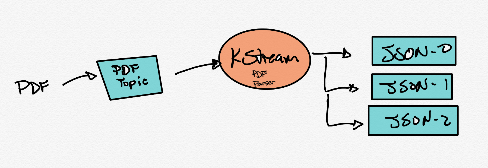

# KStream PDF parser

This example uses KStreams to read a topic containing PDF documents in binary format. The KStreams application will parse the PDF using *org.apache.pdfbox* library and extract the text. The text and some metadata is routed to different topics based on content of the PDF. A S3 sink connector will read these topics and write them to a S3 bucket in AWS.

***PDF files are big and could exceed the maximum size the Kafka Topic can hold. If you find your PDF files are too big, consider sending a reference (URL to Artifactory for example) to Kafka instead of the PDF contents and have your consumers download them from the reference.***



## Credentials

This demo uses the **Credentials file** approach to enable the S3 Sink Connector to send data to S3. See link below for details in setting this up. The docker-compose.yml file in this project uses a volume pointed to a ~/.aws local directory. If you do not have one, the link below will point you to the instructions to get youself setup with this file locally.

[AWS Credentails](https://docs.confluent.io/current/connect/kafka-connect-s3/index.html#s3-connector-credentials)

## Kafkacat requirements

You need to install kafkacat to fully run this demo. See this [GitHub repo](https://github.com/edenhill/kafkacat) for installation.

```bash
# for macos
brew install kafkacat
```

## Getting Started

### Startup

```bash
make build # builds the KStream application
make cluster # build the Confluent Platform (CP)
make topics # creates the topics in CP
```

### Create the S3 sink connector in ksqlDB

Replace the ***MY_BUCKET_CHANGE_ME*** value to be the bucket name you want the S3 sink connector to write your events. Also, you may want to change the region code in the connector configuration.

```sql
CREATE SINK CONNECTOR `s3-sink` WITH(
    "connector.class"='io.confluent.connect.s3.S3SinkConnector',
    "tasks.max"='1',
    "s3.bucket.name"='MY_BUCKET_CHANGE_ME',
    "time.interval" = 'HOURLY',
    "format.class"= 'io.confluent.connect.s3.format.json.JsonFormat',
    "flush.size"  = '3',
    "storage.class"= 'io.confluent.connect.s3.storage.S3Storage',
    "value.converter"='org.apache.kafka.connect.json.JsonConverter',
    "key.converter"='org.apache.kafka.connect.storage.StringConverter',
    "key.converter.schemas.enable"='false',
    "value.converter.schemas.enable"='false',
    "topics"= 'pdf-json-0,pdf-json-1,pdf-json-2',
    "s3.region"='us-east-1'
);

DROP CONNECTOR "s3-sink"; -- If you want to make changes to the connector, drop it and execute the create statement again.
```

#### Start the KSQLDB CLI

Start the ksql cli using the make command below and execute the ksql commands above. Type **exit** to leave the cli.

```bash
make ksql
```

## Start the KStream application

```bash
make kstream
```

## Send a pdf to Kafka using Kakfacat

Run the command below multiple times so that it meets the ***flush.size*** property. In this case 3 records must be sent.

```bash
make send PDF=pdf/sample.pdf
```

## Show the contents of the bucket

```bash
aws s3 ls s3://my_bucket/topics/pdf-json-[0-1]/partition=[0-6]/
```

## Cat a file in S3

```bash
aws s3 cp s3://my_bucket/topics/pdf-json-[0-1]/partition=[0-6]/pdf-json-1+0+0000000000.json -
```
