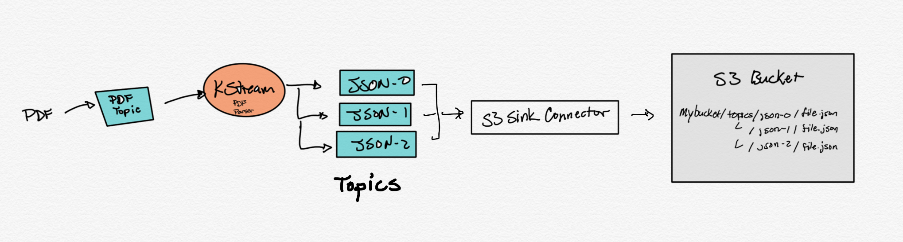

# KStream PDF parser

This example uses KStreams to read a topic containing PDF documents in binary format. The KStreams application will parse the PDF using *org.apache.pdfbox* library and extract the text. The text and some metadata is routed to different topics based on content of the PDF.

## Credentials

This demo uses the **Credentials file** approach to enable the S3 Sink Connector to send data to S3. See link below for details in setting this up. The docker-compose.yml file in this project uses a volume pointioned to a ~/.aws local directory. If you do not have one, the link below will point you to the instructions to get youself setup with this file locally.

[AWS Credentails](https://docs.confluent.io/current/connect/kafka-connect-s3/index.html#s3-connector-credentials)
